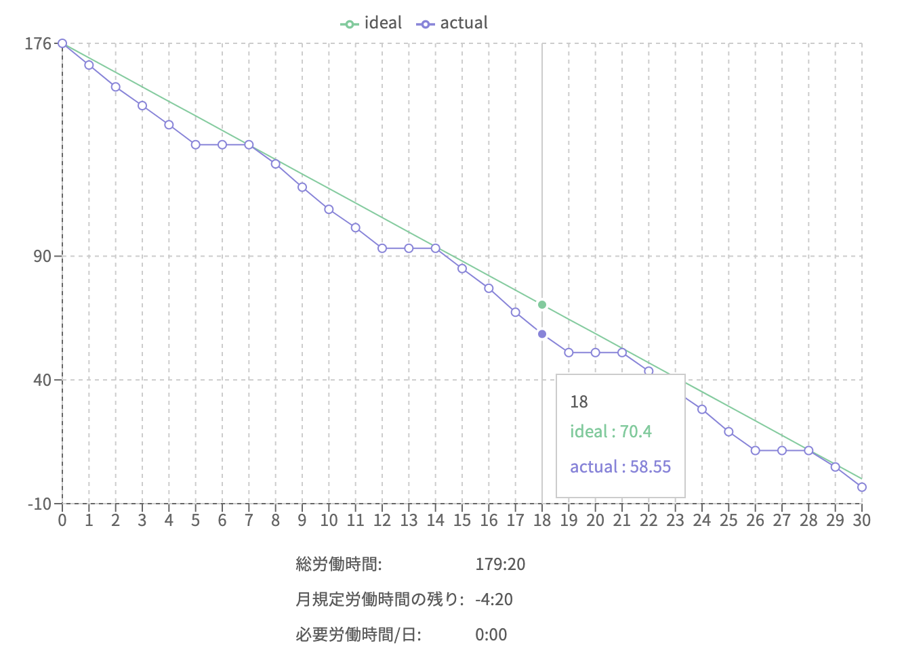

# Jobcan Burndown

## これなに

ジョブカンの勤務時間の残りをバーンダウンチャート風に表示する Chrome 拡張です。
働きすぎ（働かなすぎ）を計画的に防いでワークとライフのバランスを良い感じにしていくぞ。

## インストール

Chrome ウェブストアには公開してません（愚直にマークアップを拾っていて非常に壊れやすく管理したくないため）。
ソースコードをローカルに展開して使います。

### ソースコードの展開

```
git clone https://github.com/upinetree/jobcan_burndown.git
yarn build
```

### Chrome 拡張に読み込み

- Chrome の拡張機能の「デベロッパーモード」を有効に
- 「パッケージ化されていない拡張機能を読み込む」で展開したソースコードの `dist` ディレクトリを指定

## 使い方

ジョブカンの出勤簿画面 (`https://ssl.jobcan.jp/employee/attendance`) を表示すると、以下のようなバーンダウンチャートが出現します。


